- 👋 Hi, I’m @MZuhairKhan
- 👀 I’m interested in quantum computing.
- 🌱 I’m currently learning Python, Scala and quantum technology.
- 💞️ I’m looking to collaborate on qiskit/cirq projects.

----

### Some Stats - 

 

  

    
    
     
  

<!---
MZuhairKhan/MZuhairKhan is a ✨ special ✨ repository because its `README.md` (this file) appears on your GitHub profile.
You can click the Preview link to take a look at your changes.
--->
